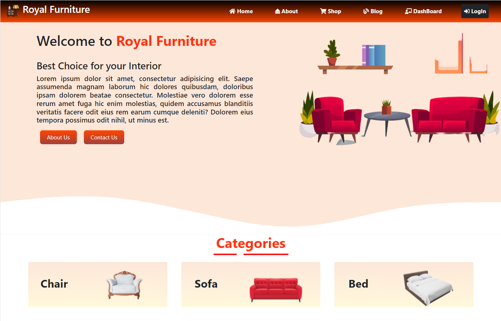

# Royal Furniture 

# Features 
- Complete web application with a dynamic products, blogs and review section.
- User can order product, cancel orders, give review, read blogs and can send email.
- Admin can add, update and delete products and blogs.
- Admin can add new admin and can change the status of the order list.
- Admin can see todays, pending and total order in the dashboard.
- Firebase Authentication & hosting, Stripe payment gateway are also included. 
- use default admin access with email default77@admin.com and #dev2021.

# Technology
- HTML5
- CSS3
- Bootstrap5
- JavaScript
- React 
- Firebase
- Node JS
- Express JS
- MongoDB

###  `Demo Video :` [YouTube](https://youtu.be/SMhTJ6ZCfaw)
###  `Website Link :` [Live Site](https://royal-furniture-6905b.firebaseapp.com/)
###  `Server Repo Link :` [Github](https://github.com/naeemmahmud70/Royal-furniture-server)
